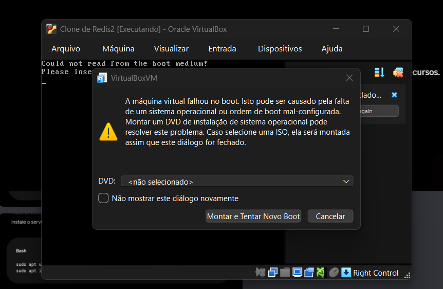

# Anexo — Problemas com o VirtualBox e mudança para Docker

Relato dos problemas enfrentados na primeira tentativa (VMs no Oracle VirtualBox) e a solução adotada para não ficar sem entrega. O laboratório que a turma deve replicar está no [README](../README.md).

Evidências originais: pasta `[erro/](../erro/)` (print de boot e export do clone Redis3).

## O que tentamos

O plano inicial era o desenho clássico de laboratório em VM: várias máquinas Ubuntu no VirtualBox (clones **Redis2**, **Redis3**, etc.), rede Host-Only na faixa `192.168.56.0/24`, e o Redis instalado em cada uma — um nó master e o restante como réplica.

Na prática o ambiente não ficou estável a tempo da entrega (22/09/2026).

## O que quebrou

### 1. Clone sem mídia de boot

Ao ligar o **Clone de Redis2**, o VirtualBox mostrou *Could not read from the boot medium* e o diálogo:

> A máquina virtual falhou no boot. Isto pode ser causado pela falta de um sistema operacional ou ordem de boot mal-configurada.

O campo **DVD** ficou em `<não selecionado>`. Sem ISO de instalação e sem disco de sistema utilizável, a VM não chega no Ubuntu — logo não há Redis para demonstrar.

### 2. Clone Redis3: boot em cadeia e disco ausente no export

O log do **Clone de Redis3** (`VBox.log` dentro do zip em `erro/`) registra:

- *Boot from Floppy 0 failed*
- *CD-ROM boot failure code : 0003* / *Boot from CD-ROM failed*
- em seguida *Booting from Hard Disk...*

A configuração da VM apontava uma ISO no Windows de um integrante (`C:/Users/lucas/Downloads/ubuntu-26.04.1-live-server-amd64.iso`). O pacote exportado **não inclui o disco virtual (.vdi)** — só `.vbox` e logs. Sem o disco, o clone não é reproduzível em outra máquina e o boot continua dependente de mídia que não está no projeto.

### 3. Peso do VirtualBox

Mesmo quando a VM subia, várias instâncias (master, réplica e, no desenho completo, sentinels) deixavam o host pesado. Isso atrasava teste, demo e o ciclo “derrubar o master e ver a réplica assumir”.

## Solução adotada

Reescrevemos o mesmo desenho **em Docker Compose**: um container por nó, IPs fixos na rede `redelocal`, replicação master/réplica e **Sentinel** para o failover automático (continuidade do serviço, exigida pelo roteiro).

A faixa `192.168.56.0/24` do Host-Only do VirtualBox **não** foi reutilizada: o Docker recusou o pool (*Pool overlaps with other one on this address space*). O laboratório usa `172.28.56.0/24`, com a mesma ideia de endereços fixos (`.10` master, `.20` réplica, `.31–.33` Sentinels).

O Docker não muda o conteúdo da disciplina (replicação, consistência, HA, cache). Muda só a forma de empacotar as instâncias, de um jeito leve e repetível (`docker compose up`), para o grupo **conseguir entregar** o laboratório funcional.

## O que isso cobre no roteiro

| Exigência             | Como ficou                                                    |
| --------------------- | ------------------------------------------------------------- |
| Problemas enfrentados | VirtualBox: boot sem mídia, clone incompleto, ambiente pesado |
| Solução adotada       | Laboratório em Docker + Sentinel                              |
| Entrega               | README + `docker-compose.yml` + scripts de demo               |

